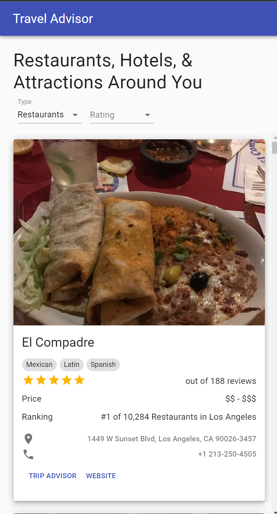

<h1>Travel Advisor Companion App</h1>
<p><i>Tutorial Provided By: <a href="https://www.youtube.com/watch?v=GDa8kZLNhJ4&t=23390s&ab_channel=JavaScriptMastery">JavaScript Mastery</a></i></p>

> <i><b>NOTE:</b> In order for this app to work, you must grant location access to your browser.</i>

<br/>
*
<br/>
*
<br/>
*
<br/>
<br/>

<h2><b>About</b></h2>
<p>This app is a companion app for the Travel Advisor website. It features data fetching for the browser's IP address for restaurants, hotels, and attractions.<p>

<br/>

|                                 <b>FEATURES</b>                                 |                                                                                                                         <b>DESCRIPTIONS</b>                                                                                                                          |
| :-----------------------------------------------------------------------------: | :------------------------------------------------------------------------------------------------------------------------------------------------------------------------------------------------------------------------------------------------------------------: |
|                  <a href="https://rapidapi.com/">Rapid API</a>                  |                                                                                                              Discover and connect to thousands of API's                                                                                                              |
|                   <a href="https://mui.com/">Material UI</a>                    |                                                                                                A comprehensive suite of UI tools to help you ship new features faster                                                                                                |
| <a href="https://www.npmjs.com/package/react-google-maps">React Google Maps</a> |                                                                                                                                                                                                                                                                      |
|              <a href="https://axios-http.com/docs/intro">Axios</a>              |                                                                                                   Axios is a promise-based HTTP Client for node.js and the browser                                                                                                   |
| <a href="https://react-google-maps-api-docs.netlify.app/">Google Map React</a>  | This is complete re-write of the ... react-google-maps library ... provides very simple bindings to the <a href="https://developers.google.com/maps/documentation/javascript/">Google Maps JavaScript API v3</a> and lets you use it in your app as React components |

<br/>
*
<br/>
*
<br/>
*
<br/>
<br/>

<h3><b>Example of Rapid API Usage</b></h3>

<ul>
<li>Import axios</li>
<li>Create an async function that will fetch the data using <b><i>params</i></b> and <b><i>headers</i></b> objects provided by Rapid API</li>
<li>In this case, <b>bl_latitude</b> &#40;bottom-left latitude&#41;, <b>tr_latitude</b> &#40;top-right latitude&#41;, <b>bl_longitude</b> &#40;bottom-left longitude&#41;, and <b>tr_longitude</b> &#40;top-right longitude&#41; need to be dynamically set by parameters that will be defined by a <b>useEffect()</b> in the root component <b>App</b>.</li>
</ul>

<br/>

<code>api/index.js</code>

```js
import axios from "axios";

export const getPlacesData = async (type, sw, ne) => {
  try {
    const {
      data: { data },
    } = await axios.get(
      `https://travel-advisor.p.rapidapi.com/${type}/list-in-boundary`,
      {
        params: {
          bl_latitude: sw.lat,
          tr_latitude: ne.lat,
          bl_longitude: sw.lng,
          tr_longitude: ne.lng,
        },
        headers: {
          "X-RapidAPI-Key": process.env.REACT_APP_RAPIDAPI_KEY,
          "X-RapidAPI-Host": "travel-advisor.p.rapidapi.com",
        },
      }
    );
    return data;
  } catch (err) {
    console.log(`Something went wrong. ${err}`);
  }
};
```

<p>As mentioned above, <b><i>getPlacesData()</i></b> is being called by <b>useEffect</b> and given parameters of <b>type</b> and <b>bounds</b>, provided by the <b>&#60;List&#62;</b> component and <b>&#60;Map&#62;</b> component, respectively.</p>

<code>App.js</code>

```js
// ... other code ...

useEffect(() => {
  if (bounds.sw && bounds.ne) {
    setIsLoading(true);

    getPlacesData(type, bounds.sw, bounds.ne).then((data) => {
      setPlaces(data?.filter((place) => place.name && place.num_reviews > 0));
      setFilteredPlaces([]);
      setIsLoading(false);
    });
  }
}, [type, bounds]);

return (
  <>
    <CssBaseline />
    <Header setCoordinates={setCoordinates} />
    <Grid container spacing={3} style={{ width: "100%" }}>
      <Grid item xs={12} md={4}>
        <List
          places={filteredPlaces.length ? filteredPlaces : places}
          childClicked={childClicked}
          isLoading={isLoading}
          type={type}
          setType={setType}
          rating={rating}
          setRating={setRating}
        />
      </Grid>
      <Grid item xs={12} md={8}>
        <Map
          coordinates={coordinates}
          setCoordinates={setCoordinates}
          setBounds={setBounds}
          places={filteredPlaces.length ? filteredPlaces : places}
          setChildClicked={setChildClicked}
        />
      </Grid>
    </Grid>
  </>
);
```

<br/>

<h3><b>Example of React Google Maps Usage</b></h3>

<p><b>GoogleMapReact</b> will basically dynamically change the values of <i>bounds</i> and <i>coordinates</i> in order to provide relevant data to the user based on the bottom-left and top-right coordinates of the map's focused area. <a href="https://github.com/google-map-react/google-map-react#readme">Learn More</a>.

<br/>

<code>components/Map/Map.jsx</code>

```js
import "./styles";
import GoogleMapReact from "google-map-react";
import { Paper, Typography, useMediaQuery } from "@material-ui/core";
import LocationOnOutlinedIcon from "@material-ui/icons/LocationOnOutlined";
import Rating from "@material-ui/lab/Rating";
import useStyles from "./styles";
import mapStyles from "./mapStyles";

const Map = ({
  coordinates,
  setCoordinates,
  setBounds,
  places,
  setChildClicked,
}) => {
  const classes = useStyles();
  // useMediaQuery will be false if width is larger than 600px
  const isDesktop = useMediaQuery("(min-width: 600px)");

  return (
    <div className={classes.mapContainer}>
      <GoogleMapReact
        bootstrapURLKeys={{ key: process.env.REACT_APP_GOOGLE_MAPS_API_KEY }}
        center={coordinates}
        defaultZoom={14}
        margin={[50, 50, 50, 50]}
        options={{
          disableDefaultUI: true,
          zoomControl: true,
          styles: mapStyles,
        }}
        onChange={(e) => {
          setCoordinates({ lat: e.center.lat, lng: e.center.lng });
          setBounds({ ne: e.marginBounds.ne, sw: e.marginBounds.sw });
        }}
        onChildClick={(child) => {
          setChildClicked(child);
        }}
      >
        {places?.map((place, i) => (
          <div
            className={classes.markerContainer}
            lat={Number(place.latitude)}
            lng={Number(place.longitude)}
            key={i}
          >
            {!isDesktop ? (
              <LocationOnOutlinedIcon color="primary" fontSize="large" />
            ) : (
              <Paper elevation={3} className={classes.paper}>
                <Typography
                  className={classes.typography}
                  variant="subtitle2"
                  gutterBottom
                >
                  {place.name}
                </Typography>
                
                <Rating size="small" value={Number(place.rating)} readOnly />
              </Paper>
            )}
          </div>
        ))}
      </GoogleMapReact>
    </div>
  );
};

export default Map;
```

<br/>

<h3><b>Example of Material UI Usage</b></h3>

<p>The <b>PlaceDetails</b> component renders a list of cards, which is a great example to look at because it contains many <b>Material UI</b> elements.</p>



<br/>

<code>components/PlaceDetails/PlaceDetails.jsx</code>

```js
import {
  Box,
  Typography,
  Button,
  Card,
  CardMedia,
  CardContent,
  CardActions,
  Chip,
} from "@material-ui/core";
import LocationOnIcon from "@material-ui/icons/LocationOn";
import PhoneIcon from "@material-ui/icons/Phone";
import Rating from "@material-ui/lab/Rating";
import useStyles from "./styles";

const PlaceDetails = ({ place, selected, refProp }) => {
  const classes = useStyles();

  if (selected)
    refProp?.current?.scrollIntoView({ behavior: "smooth", block: "start" });

  return (
    <Card elevation={6}>
      <CardMedia
        style={{ height: 350 }}
        image={
          place.photo
            ? place.photo.images.large.url
            : "https://www.foodserviceandhospitality.com/wp-content/uploads/2016/09/Restaurant-Placeholder-001.jpg"
        }
        title={place.name}
      />
      <CardContent>
        <Typography gutterBottom variant="h5">
          {place.name}
        </Typography>
        {place?.cuisine?.map(({ name }) => (
          <Chip key={name} size="small" label={name} className={classes.chip} />
        ))}
        <Box display="flex" justifyContent="space-between">
          <Rating value={Number(place.rating)} readOnly />
          <Typography gutterBottom variant="subtitle1">
            out of {place.num_reviews} reviews
          </Typography>
        </Box>
        <Box display="flex" justifyContent="space-between">
          <Typography variant="subtitle1">Price</Typography>
          <Typography gutterBottom variant="subtitle1">
            {place.price_level}
          </Typography>
        </Box>
        <Box display="flex" justifyContent="space-between">
          <Typography variant="subtitle1">Ranking</Typography>
          <Typography gutterBottom variant="subtitle1">
            {place.ranking}
          </Typography>
        </Box>
        {place?.awards?.map((award) => (
          <Box
            key={award}
            display="flex"
            justifyContent="space-between"
            alignItems="center"
            my={1}
          >
            
            <Typography variant="subtitle2" color="textSecondary">
              {award.display_name}
            </Typography>
          </Box>
        ))}
        {place?.address && (
          <Typography
            gutterBottom
            variant="subtitle2"
            color="textSecondary"
            className={classes.subtitle}
          >
            <LocationOnIcon /> {place.address}
          </Typography>
        )}
        {place?.phone && (
          <Typography
            gutterBottom
            variant="subtitle2"
            color="textSecondary"
            className={classes.spacing}
          >
            <PhoneIcon /> {place.phone}
          </Typography>
        )}
        <CardActions>
          <Button
            size="small"
            color="primary"
            onClick={() => window.open(place.web_url, "_blank")}
          >
            Trip Advisor
          </Button>
          <Button
            size="small"
            color="primary"
            onClick={() => window.open(place.website, "_blank")}
          >
            Website
          </Button>
        </CardActions>
      </CardContent>
    </Card>
  );
};

export default PlaceDetails;
```

<br/>
